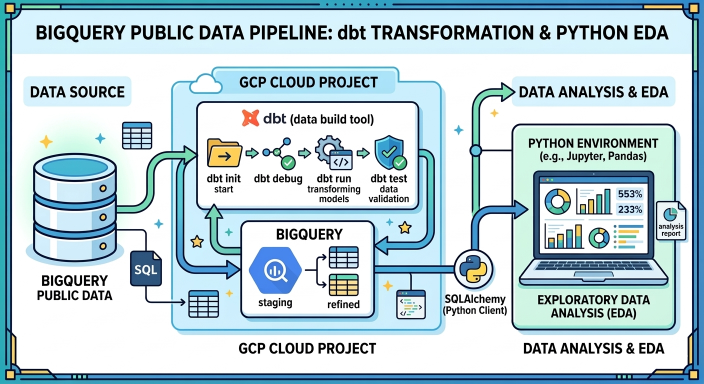

## ELT and Data Analysis - london_bicycles

### 1. Data Ingestion
- Source data: [london_bicycles dataset](https://console.cloud.google.com/bigquery?ws=!1m4!1m3!3m2!1sbigquery-public-data!2slondon_bicycles)  
- Data warehouse: BigQuery

### 2. Data Warehouse Design
- Star schema
- Dimension tables: dim_station, dim_hire
- Fact table: fact_hire

### 3. ELT Pipeline
- dbt model *./models/fact_hire.sql*  
  - Data cleaning & filtering: *start_date>=yyyy, duration>0, start_station_id IS NOT NULL*
  - Derived columns: *duration_minutes, part_of_day, part_of_week, season*
- dbt model *./models/star/dim_hire.sql* 
  - Data filtering: *start_date>=yyyy*
  - Derived columns: *start_total, end_total*
- dbt model *./models/star/dim_station.sql* 
  - Data filtering: *start_date>=yyyy*

### 4. Data Quality Testing
- dbt model *./models/fact_hire.sql* implemented tests using dbt, *dbt_utils* and *dbt_expectations*
- 11 data tests for null values, duplicates, referential integrity and data type

### 5. Data Analysis with Python
- Aggregate data using SQL query in BigQuery
- Connect to data warehouse using SQLAlchemy to fetch desired tables
- Validate data using Great Expectations
- Perform EDA using Pandas and Seaborn

### 6. Data Pipeline

### Ref:
- Gemini
- https://hub.getdbt.com/dbt-labs/dbt_utils/latest/
- https://hub.getdbt.com/calogica/dbt_expectations/latest/